# 🏦 PocketBank – Spring Boot Banking Application

PocketBank is a full-stack banking management system built using **Java 17** and **Spring Boot**.  
It simulates real-world banking workflows and demonstrates secure authentication, financial transactions, and clean backend architecture.

---

## ✨ Key Features

- Secure user registration and login (Spring Security + BCrypt)
- Role-based access control (Admin / Customer)
- Bank account creation and admin approval
- Deposit, withdrawal, and fund transfer
- Transaction history tracking
- Loan application and approval workflow
- Fixed deposit creation with interest calculation
- Admin dashboard for system management
- Responsive UI with light and dark themes

---

## 🛠 Tech Stack

### Backend

- Java 17
- Spring Boot
- Spring Security
- Spring Data JPA
- Hibernate

### Frontend

- Thymeleaf
- Bootstrap 5
- JavaScript

### Database & Tools

- MySQL
- Maven
- Git
- JUnit 5
- Mockito
- H2 Database (Testing)

---

## 📸 Screenshots

### Landing Page

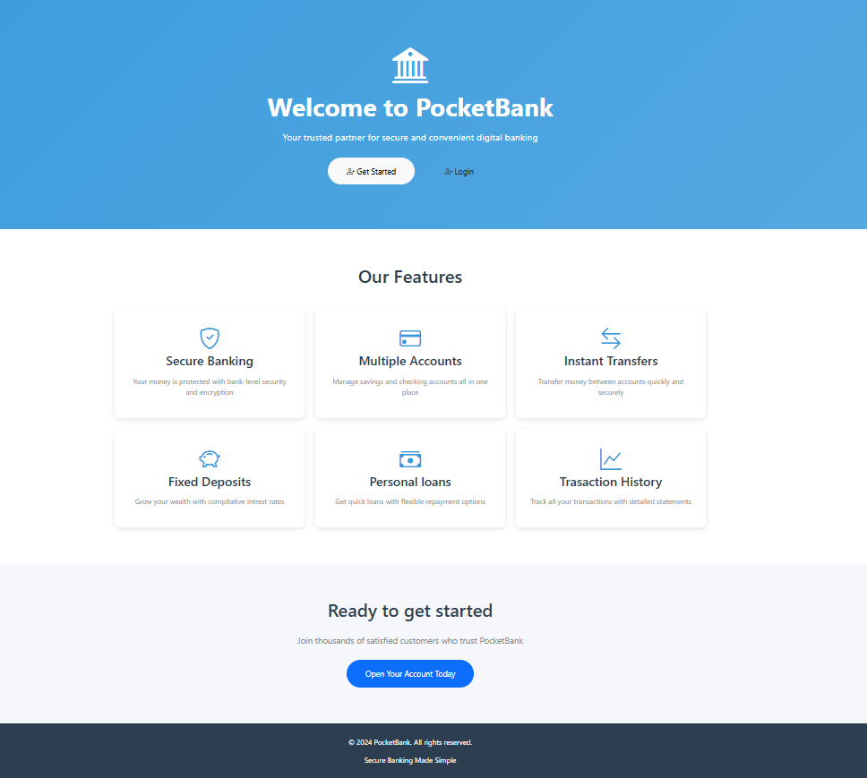

### Authentication

#### Login

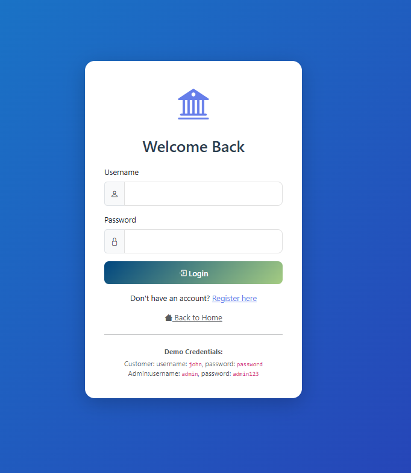

#### Registration

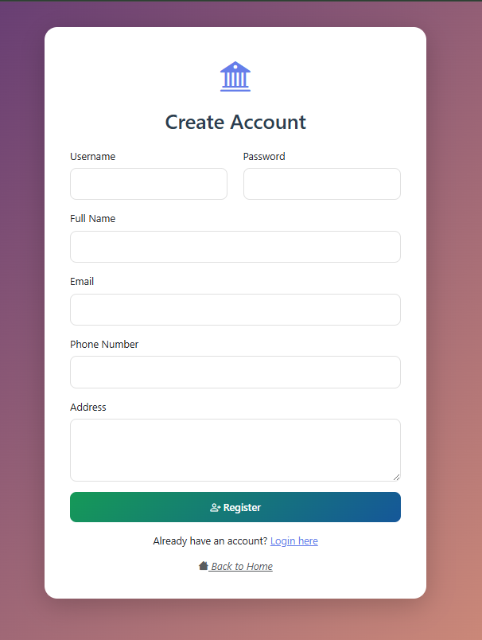

---

### Customer Dashboard

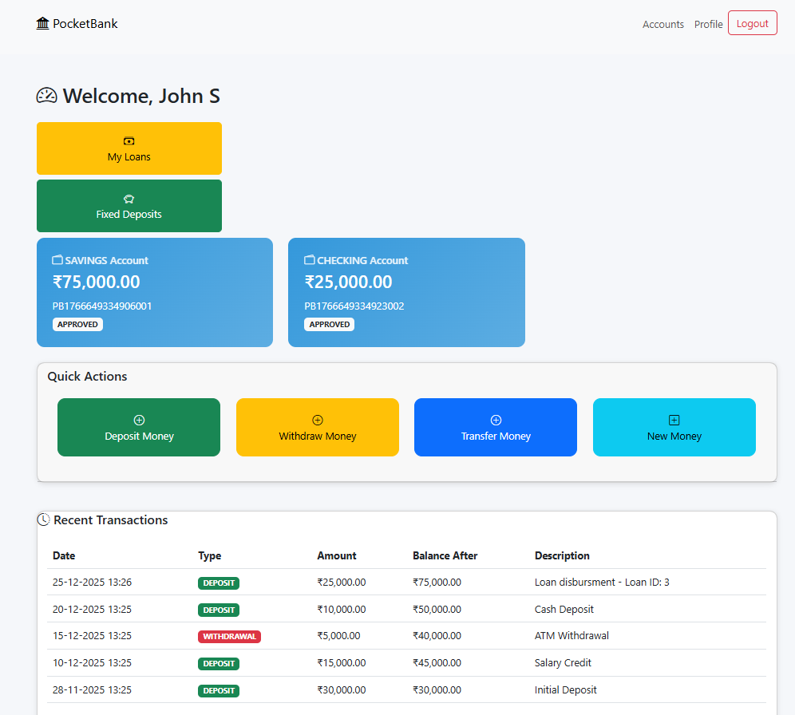

---

### Account Management

#### My Accounts

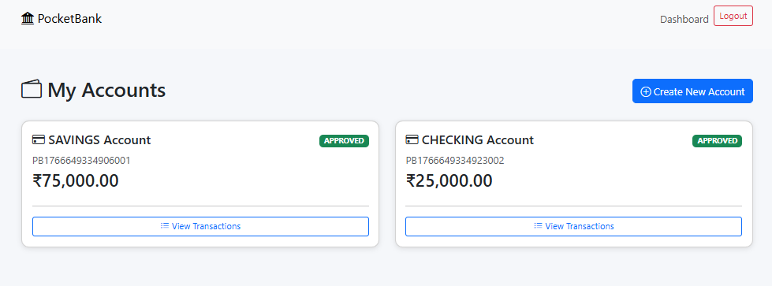

#### Create Account

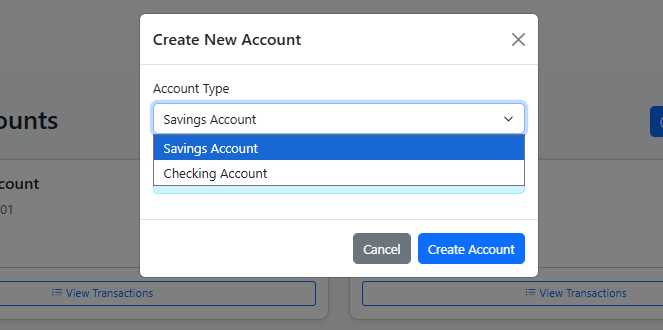

---

### Transactions

#### Deposit

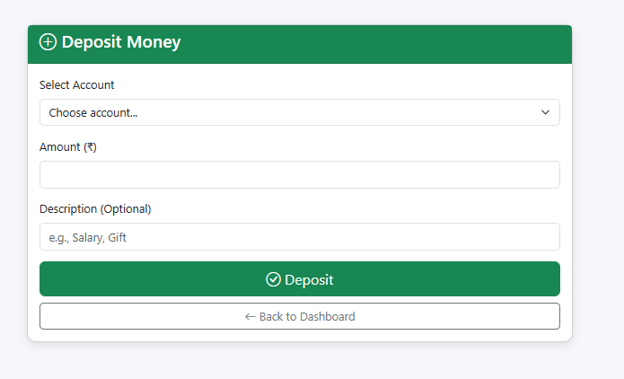

#### Withdraw

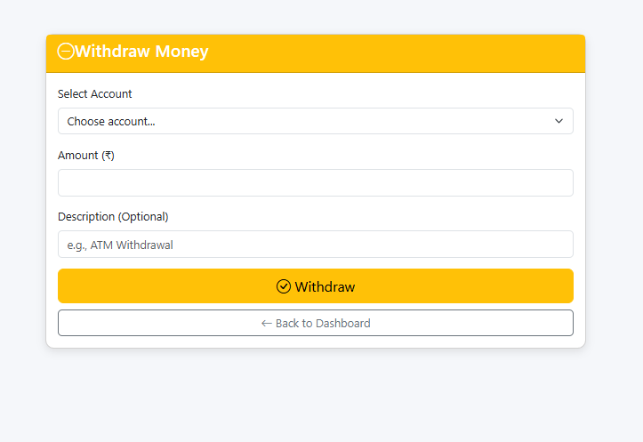

#### Transfer

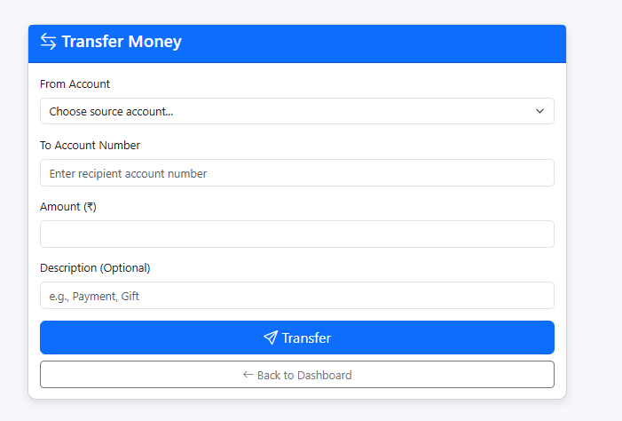

---

### Loan Management

#### Loans List

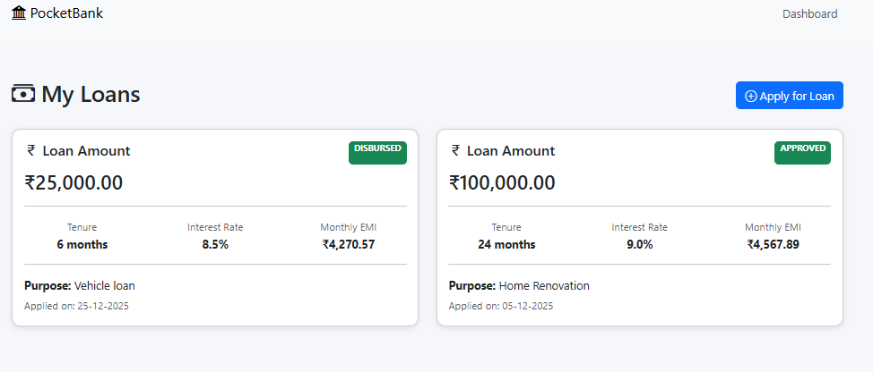

#### Apply Loan

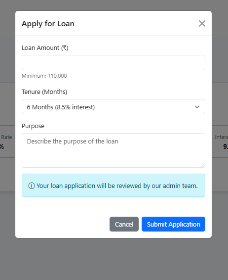

---

### Fixed Deposits

#### My Fixed Deposits

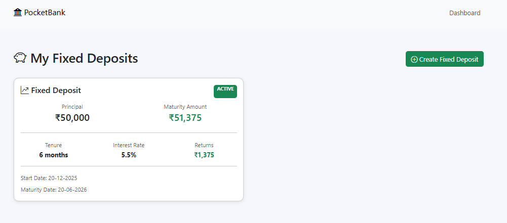

#### Create Fixed Deposit

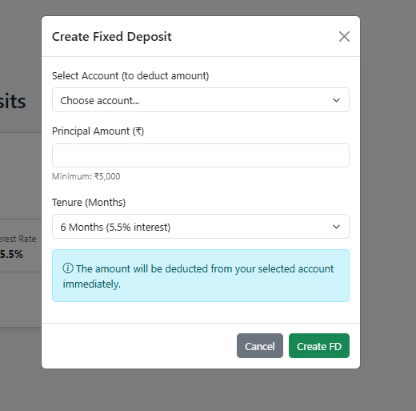

---

### Admin Dashboard

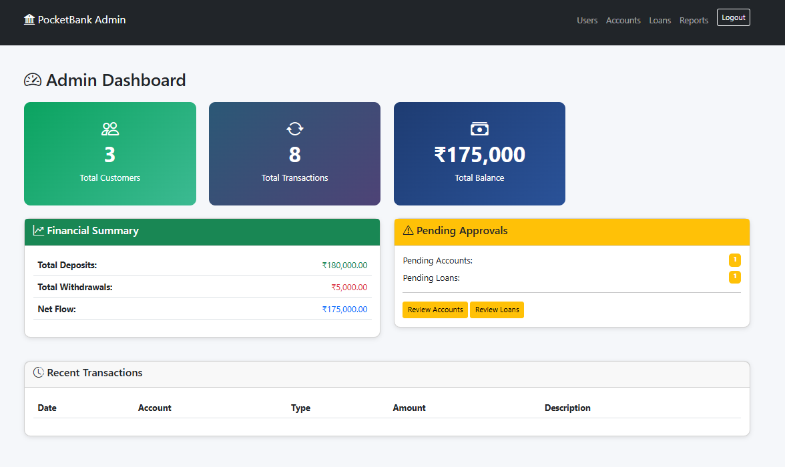

#### Financial Reports

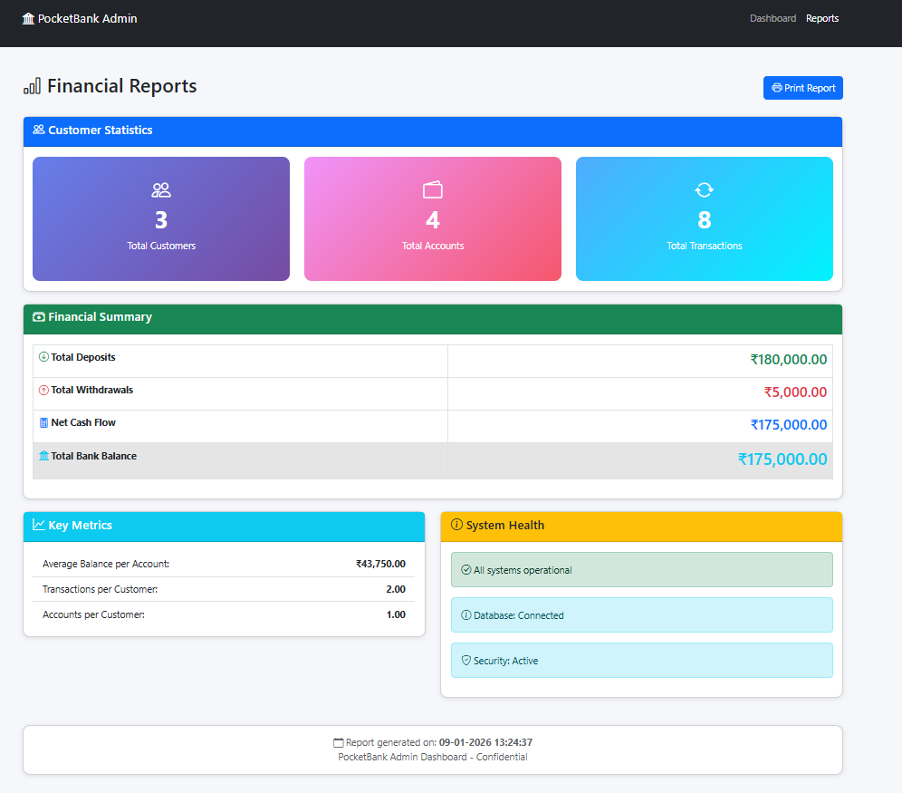

#### Pending Accounts

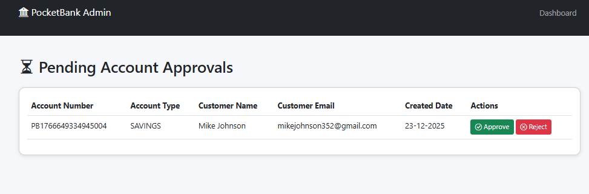

#### Loan Management

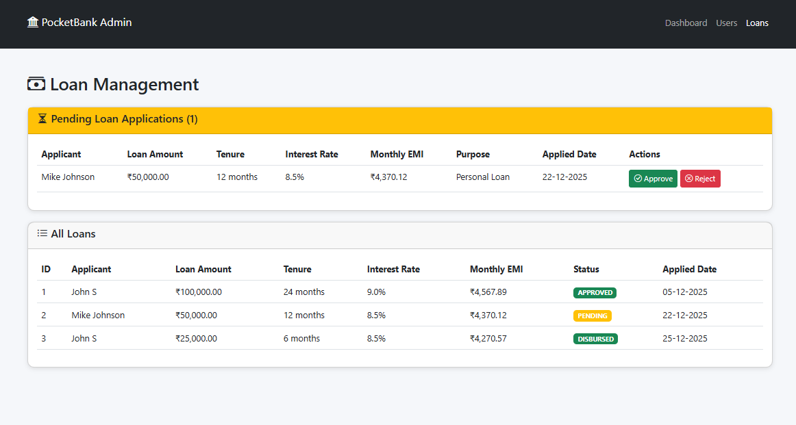

#### User Details

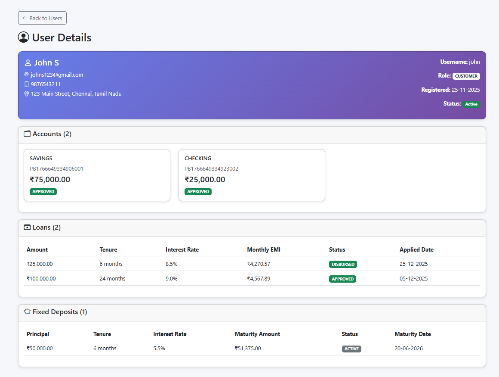

---

## 🧪 Testing

- Unit and integration tests across service, controller, and repository layers
- In-memory H2 database used for testing
- Mockito for mocking dependencies

Run tests:

```bash
mvn test
```

---

## 🚀 How to Run Locally

### Prerequisites

- Java 17 or higher
- Maven 3.8+
- MySQL 8.0+
- Git

### Clone Repository

```bash
git clone https://github.com/vimal046/pocketbank.git
cd pocketbank
```

### Database Setup

```sql
CREATE DATABASE pocketbank_db;
```

Update `application.properties`:

```properties
spring.datasource.username=your_username
spring.datasource.password=your_password
```

### Run Application

```bash
mvn spring-boot:run
```

Access:

```
http://localhost:8080
```

---

## 📁 Project Structure

```
pocketbank/
├── src/main/java/com/example/pocketbank
│   ├── config
│   ├── controller
│   ├── entity
│   ├── repository
│   └── service
├── src/main/resources
│   ├── templates
│   └── application.properties
├── src/test/java
├── screenshots
├── pom.xml
└── README.md
```

---

## 🔒 Security

- BCrypt password encryption
- CSRF protection
- Role-based authorization
- Input validation
- Secure session handling

---

## 🚀 Future Enhancements

- Email notifications
- Two-factor authentication
- Swagger API documentation
- Docker support
- REST API version
- Mobile application

---

## 👨‍💻 Author

**Vimal**  
Aspiring Java Backend / Spring Boot Developer

- GitHub: [https://github.com/vimal046](https://github.com/vimal046)
- LinkedIn: [https://linkedin.com/in/vimal046](https://linkedin.com/in/vimal046)

---

⭐ If you find this project useful, please consider starring the repository.
